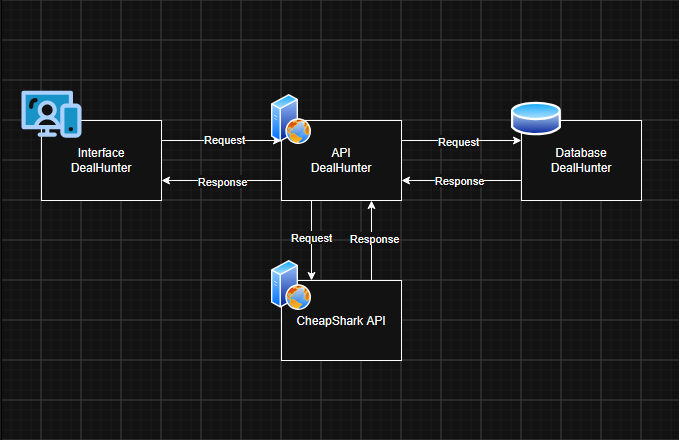

# Deal Hunter

Deal Hunter is an online game wishlist platform that hunts for the best deals across multiple virtual stores using the [CheapShark API](https://apidocs.cheapshark.com). Users can create accounts, search for games, build wishlists, and share them publicly or keep them private.
[Português (PT-BR)](./README_pt-BR.md)

## Architecture



## Requirements

### Developer

To run the project locally and make changes to the code:

- [Node.js 22 or greater](https://nodejs.org)
- [pnpm](https://pnpm.io)

### Production

To deploy a production build:

- [Docker](https://www.docker.com)

## Usage

### Development

1. Install dependencies:

   ```bash
   pnpm install
   ```

2. Start the development server:

   ```bash
   pnpm dev
   ```

3. Open [http://localhost:3000](http://localhost:3000) in your browser.

### Production

Build and run with Docker:

```bash
docker build -t deal-hunter .
docker run -p 3000:3000 deal-hunter
```

## API Documentation

The backend provides a RESTful API documented with Swagger/OpenAPI at `http://localhost:5000/openapi/swagger`.

### Main Endpoints

| Method | Endpoint                             | Description                             |
| ------ | ------------------------------------ | --------------------------------------- |
| POST   | `/api/auth/register`                 | Create account                          |
| POST   | `/api/auth/login`                    | Authenticate user                       |
| GET    | `/api/users/me`                      | Get current user profile                |
| PUT    | `/api/users/me`                      | Update user (username, email, password) |
| DELETE | `/api/users/me`                      | Delete account                          |
| GET    | `/api/wishlist/search?q=`            | Search games via CheapShark             |
| POST   | `/api/wishlist/`                     | Add game to wishlist                    |
| PUT    | `/api/wishlist/<id>`                 | Update wishlist item notes              |
| DELETE | `/api/wishlist/<id>`                 | Remove from wishlist                    |
| GET    | `/api/wishlist/game/<cheapshark_id>` | Get deals and pricing info              |

## External API — CheapShark

Deal Hunter integrates the [CheapShark API](https://www.cheapshark.com/api/1.0), a free public game deal aggregation service that does not require registration or an API key.

### Endpoints Used

| Endpoint                  | Purpose                                                   |
| ------------------------- | --------------------------------------------------------- |
| `GET /api/1.0/games`      | Search games by title                                     |
| `GET /api/1.0/games/<id>` | Get game details with active deals and historical pricing |

### Data Flow

The backend proxies CheapShark requests to avoid exposing the external API directly from the frontend. Game search queries are sent to CheapShark, results are cached in-memory using a `Map`, and deal aggregation (cheapest price, all active offers, historical low) is computed server-side before being returned to the client.

[Português (PT-BR)](./README_pt-BR.md)
